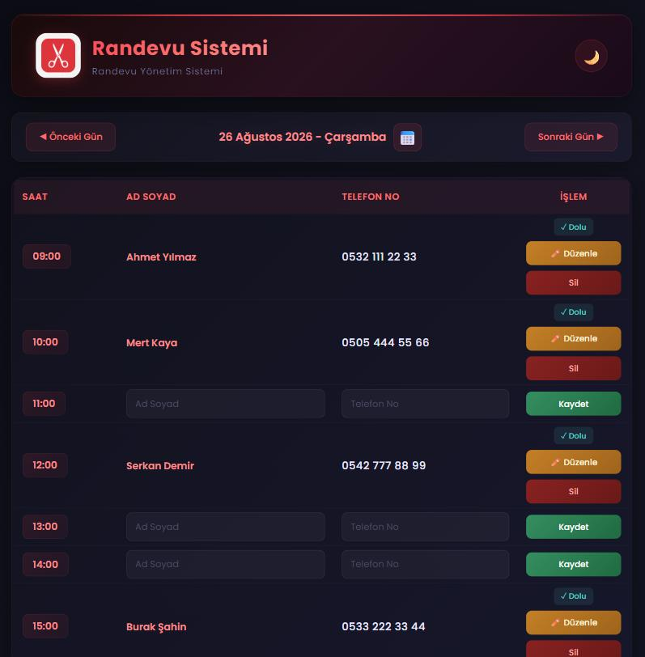
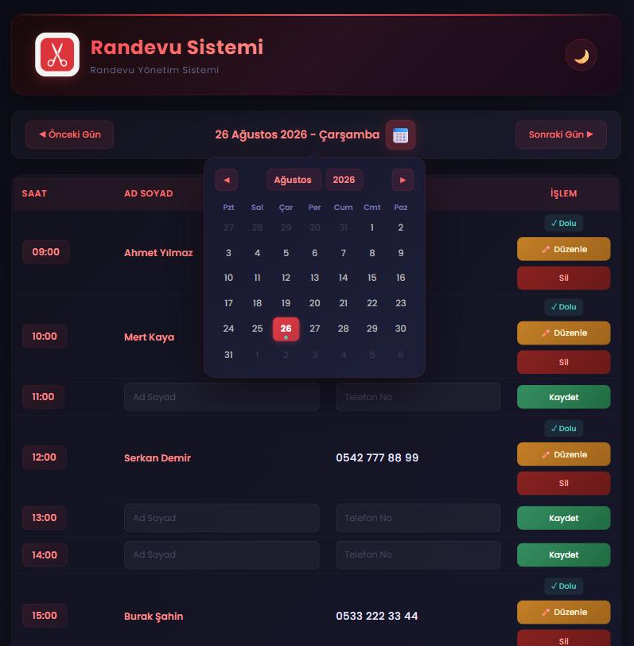
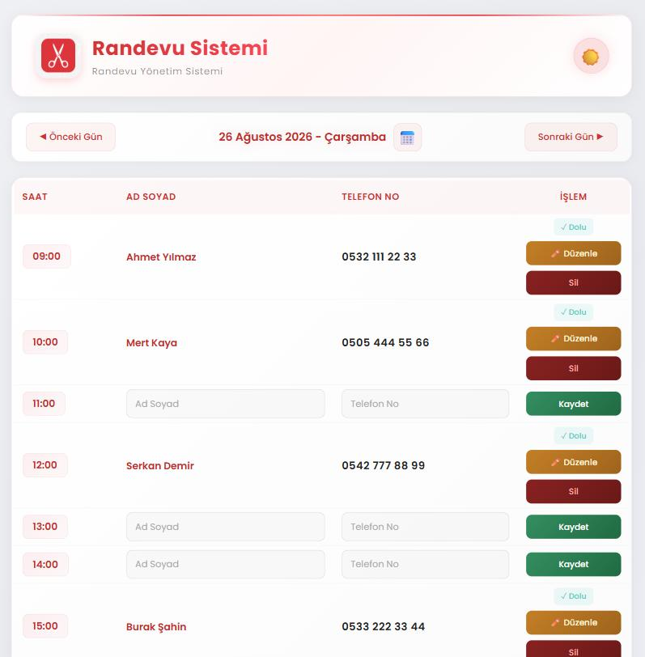

<div align="center">


# Randevu Sistemi

**Küçük işletmeler için Electron tabanlı, çevrimdışı çalışan masaüstü randevu takip uygulaması.**

Desktop appointment scheduler for small businesses — offline-first, no server, no account.

[](https://www.electronjs.org/)
[](https://developer.mozilla.org/docs/Web/JavaScript)
[](#kurulum)
[](LICENSE)



<table>
<tr>
<td align="center"><br><sub>Takvim popup'ı — randevusu olan günler işaretli</sub></td>
<td align="center"><br><sub>Açık tema</sub></td>
</tr>
</table>

</div>

---

## Türkçe

### Ne işe yarar?

Berber, kuaför, güzellik salonu, muayenehane gibi gün içinde saat başı randevu alan küçük işletmeler için yazıldı. Kurulum, üyelik, internet bağlantısı gerektirmez — çift tıkla, çalıştır.

Gün, `09:00`–`00:00` arası 16 saatlik slota bölünür. Her slot ya boştur (ad + telefon girip **Kaydet**) ya da doludur (**Düzenle** / **Sil**).

### Özellikler

| | |
|---|---|
| **Saatlik randevu tablosu** | Sabit 16 slot, boş/dolu durumu tek bakışta |
| **Takvim popup'ı** | Ay/yıl seçici, randevusu olan günler işaretli |
| **Gün gezinme** | Önceki/sonraki gün butonları, Türkçe tarih formatı |
| **Düzenle & sil** | Kayıtlı randevu üzerinde satır içi düzenleme, silmeden önce onay |
| **Günü temizle** | Seçili günün tüm randevularını tek tuşla sil |
| **Açık/koyu tema** | Tercih `localStorage`'da saklanır, açılışta hatırlanır |
| **Çevrimdışı** | Veriler tamamen yerelde (`localStorage`), sunucu yok |

### Kurulum

```bash
git clone https://github.com/EmirhanCalik/randevu-sistemi.git
cd randevu-sistemi
npm install
npm start
```

### Windows `.exe` üretme

```bash
npm run build
```

Çıktı: `dist/Randevu Sistemi-win32-ia32/` — klasörü olduğu gibi kopyalayıp herhangi bir Windows makinesinde çalıştırabilirsiniz.

### Veri nerede tutulur?

Tüm randevular tarayıcı `localStorage`'ında, gün başına bir kayıt olarak tutulur:

```
randevu_2026-08-26  →  { "09:00": { "name": "...", "phone": "..." }, ... }
randevu_theme       →  "light" | "dark"
```

Veri tabanı yok, dış servis yok, hiçbir bilgi cihazdan çıkmaz. Uygulamayı kaldırmak veri silmek anlamına gelir — düzenli yedek için kullanıcı verisi klasörünü kopyalayın.

### Proje yapısı

```
randevu-sistemi/
├── main.js       # Electron ana süreç, pencere ayarları
├── index.html    # Uygulama iskeleti
├── style.css     # Tema değişkenleri, tablo ve takvim stilleri
├── app.js        # Tüm uygulama mantığı (takvim, tablo, CRUD, tema)
├── fonts/        # Poppins (gömülü, offline)
├── logo.png
└── icon.ico      # Paketlenmiş .exe ikonu
```

Bağımlılık yok — sadece Electron ve paketleyici. `app.js` çerçeve kullanmadan, düz DOM API'si ile yazıldı.

---

## English

### What is it?

A desktop appointment scheduler for small businesses that book hourly — barbershops, hair and beauty salons, small clinics. No server, no account, no internet connection required.

The day is split into 16 hourly slots from `09:00` to `00:00`. Each slot is either empty (type name + phone, hit **Kaydet**) or booked (**Düzenle** / **Sil**).

### Features

- Hourly appointment table with at-a-glance empty/booked state
- Calendar popup with month/year selectors; days that already have appointments are marked
- Previous/next day navigation, Turkish date formatting
- Inline edit, delete with confirmation, and clear-the-whole-day
- Light/dark theme, persisted across restarts
- Fully offline — all data lives in `localStorage`, nothing leaves the machine

### Getting started

```bash
git clone https://github.com/EmirhanCalik/randevu-sistemi.git
cd randevu-sistemi
npm install
npm start
```

Build a portable Windows executable with `npm run build`; the output lands in `dist/`.

### Notes

The UI is Turkish. Localisation would mean extracting the strings in `app.js` and `index.html` into a lookup table — a good first contribution if you want one.

---

## Yol haritası / Roadmap

- [ ] JSON dışa/içe aktarma (yedekleme)
- [ ] Randevu arama ve müşteri geçmişi
- [ ] Çalışma saatlerini ayarlanabilir yapma (şu an sabit 09:00–00:00)
- [ ] SQLite'a geçiş — çok kullanıcılı kurulumlar için
- [ ] i18n (TR/EN arayüz)

## Lisans

[MIT](LICENSE) © Emirhan Çalık
